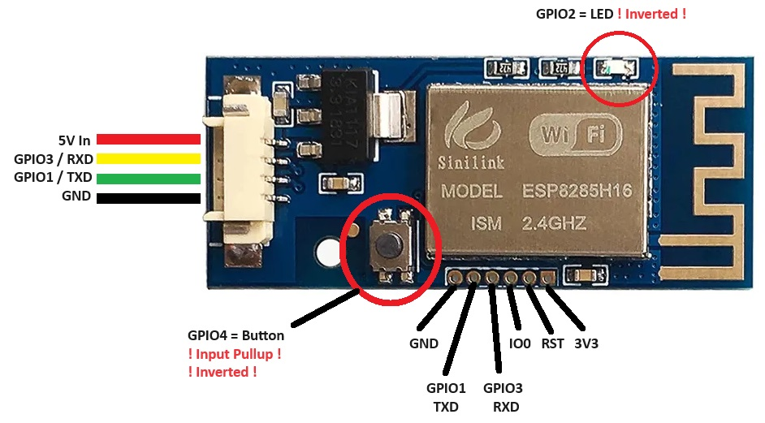

# Sinilink XY-WFPOW → XY-6509 (ESPHome)

ESPHome-Firmware für das WiFi-Modul **Sinilink XY-WFPOW** (ESP8285), das per
**Modbus RTU** das Labornetzteil / den DC-DC-Wandler **XY-6509** steuert und
ausliest. Damit hängt das XY-6509 vollständig in **Home Assistant** – inkl.
Messwerten, Sollwerten, Schutzgrenzen, Alarmquittierung und Presets.

Das XY-WFPOW ersetzt dabei seine Original-Firmware; die serielle Hardware-UART
(GPIO1/GPIO3) wird für Modbus zum XY-6509 verwendet.

## Funktionen

**Messwerte** – Ausgangsspannung/-strom/-leistung, Eingangsspannung,
Ausgangskapazität & -energie, Laufzeit, interne & externe Temperatur,
Modell- und Firmwareversion.

**Steuerung** – Sollspannung, Strombegrenzung, Ausgang ein/aus,
Auto-Einschalten nach Gerätestart, Displayhelligkeit, Display-Ausschaltzeit,
Summer, Tastensperre, Temperatureinheit, MPPT- und Konstantleistungs-Modus
sowie Presets M0–M9 **laden und speichern** (siehe [Presets](#presets)).

**Kalibrierung** – Offset für interne und externe Temperatur, damit reale
Sensorabweichungen ausgeglichen werden können.

**Schutzfunktionen** – Grenzwerte für Über-/Unterspannung (OVP/LVP),
Überstrom (OCP), Überleistung (OPP), Kapazität (OAH), Energie (OWH),
Laufzeit (OHP), interne/externe Temperatur (OTP/ETP). Die 0-abschaltbaren
Schutzfunktionen (OAH/OWH/OHP/ETP) haben zusätzlich einen Ein/Aus-Schalter,
der den zuletzt gesetzten Grenzwert merkt und wiederherstellt.

**Status** – Schutzstatus als Klartext, „Schutzabschaltung aktiv“-Sensor,
Tastensperre, Konstantstrom-Anzeige, Button „Alarm quittieren“.

**WiFi-Status auf dem XY-6509-Display** – der Verbindungszustand von ESPHome
wird ins Statusregister des XY-6509 geschrieben, damit dessen WiFi-Symbol
stimmt.

## Zwei Varianten

Zwei eigenständige, vollständige Konfigurationen – einfach die passende
kopieren:

| Datei | API |
|-------|-----|
| [`esphome.yaml`](esphome.yaml) | **mit** Verschlüsselung (empfohlen für Home Assistant) |
| [`esphome-no-encryption.yaml`](esphome-no-encryption.yaml) | **ohne** Verschlüsselung |

Beide sind identisch bis auf den `api:`-Block. Immer nur **eine** davon auf
das Gerät flashen (beide tragen denselben Gerätenamen `sinilink`).

## Secrets

`secrets.yaml` ist bewusst **nicht** im Repo (siehe `.gitignore`). Lege sie
neben der Konfigurationsdatei ab:

```yaml
# secrets.yaml
wifi_ssid: "DeinWLAN"
wifi_password: "..."

# WPA2-Fallback-AP (Rettungszugang, wenn die Station nicht kommt)
ap_password: "mind. 8 Zeichen"

# OTA-Schutz
ota_password: "..."

# Nur für esphome.yaml (verschlüsselte Variante) nötig.
# 32-Byte-Base64-Key, z.B. via `openssl rand -base64 32`
api_encryption_key: "..."
```

Die Variante ohne Verschlüsselung braucht `api_encryption_key` nicht.

## Installation – Schritt für Schritt

**Voraussetzungen:** Chrome oder Edge (für WebSerial), ein USB-Seriell-Adapter
(3,3 V!), Home Assistant mit dem Add-on „ESPHome Device Builder“.

### 1. Erstflash via web.esphome.io

Das XY-WFPOW ist ein nacktes ESP8285-Modul ohne USB – der Erstflash läuft
über einen Seriell-Adapter (**3,3 V!**) an der unteren Stiftleiste.



Verdrahtung an der **unteren Stiftleiste** (Adapter ↔ Modul):

| Adapter | Modul |
|---------|-------|
| GND     | GND |
| TX      | GPIO3 / RXD |
| RX      | GPIO1 / TXD |
| 3,3 V   | 3V3 |

Für den **Flash-Modus** zusätzlich **IO0 beim Einschalten auf GND** ziehen
(danach GND wieder lösen).

1. [web.esphome.io](https://web.esphome.io) öffnen → **Connect** → seriellen
   Port wählen.
2. **„Prepare for first use“** – flasht eine generische ESPHome-Firmware.

> Die 4-polige JST-Buchse links (5 V In / RXD / TXD / GND) ist für den
> Betrieb am XY-6509 – zum Flashen die untere Stiftleiste mit **3,3 V** nutzen,
> nicht die 5-V-Buchse.

### 2. WLAN konfigurieren

Direkt nach dem Flashen bietet web.esphome.io an, das Gerät ins WLAN zu
bringen → **SSID und Passwort eingeben**. Das Gerät ist danach im Netzwerk.

### 3. In Home Assistant hinzufügen

Home Assistant erkennt das ESPHome-Gerät automatisch:
**Einstellungen → Geräte & Dienste** → entdecktes Gerät **hinzufügen**.

### 4. Eigene Konfiguration (YAML) einspielen

1. Im **ESPHome-Dashboard** das Gerät **übernehmen** („Adopt“ / „Take control“).
2. **Edit** öffnen und den **gesamten** Inhalt durch
   [`esphome.yaml`](esphome.yaml) (bzw.
   [`esphome-no-encryption.yaml`](esphome-no-encryption.yaml)) ersetzen.
3. `secrets.yaml` im Dashboard anlegen/ergänzen (siehe [Secrets](#secrets)) –
   **wichtig:** `wifi_ssid`/`wifi_password` müssen zum WLAN aus Schritt 2
   passen, sonst fällt das Gerät nach dem Update aus dem Netz.
4. **Install → Wirelessly (OTA)** – die fertige Firmware wird über WLAN
   aufgespielt. Ab jetzt laufen alle weiteren Updates per OTA, kein Adapter
   mehr nötig.

> Bei der **verschlüsselten** Variante fragt Home Assistant beim Übernehmen
> den `api_encryption_key` ab (Wert aus `secrets.yaml`).

### Alternative: ESPHome-CLI

Wer die [ESPHome-CLI](https://esphome.io/guides/cli.html) nutzt, kompiliert und
flasht direkt:

```bash
esphome run esphome.yaml                 # mit Verschlüsselung
esphome run esphome-no-encryption.yaml   # ohne Verschlüsselung
```

## Hinweise

- **Kein Serial-Log:** `logger: baud_rate: 0`, weil die UART0 (GPIO1/GPIO3)
  für Modbus belegt ist. Debugging läuft über die ESPHome-API-Logs.
- **Rettungs-AP:** Bei fehlgeschlagener Station-Verbindung öffnet das Gerät
  den AP „Sinilink Fallback“ + Captive Portal. Ohne diesen wäre das Gerät
  nach einem misslungenen OTA nur per Neu-Flashen erreichbar.
- **Erste Adoption mit Verschlüsselung:** Nach dem Umstieg auf die
  verschlüsselte Variante muss das Gerät in Home Assistant einmal neu
  adoptiert werden (API-Key wird abgefragt). Das ist normal.
- **Alarm quittieren (experimentell):** Der Button schreibt `0` in das
  Schutzregister `0x0010`. Das Protokoll dokumentiert nur die *gelesenen*
  Fehlercodes, nicht ausdrücklich, dass Schreiben von `0` einem Tastendruck
  entspricht – getestet aber unsicher.
  Zudem können **OAH/OWH/OHP** sofort erneut auslösen, weil ihre Zähler
  (Kapazität/Energie/Laufzeit) beim Quittieren nicht zurückgesetzt werden.

## Presets

Der XY-6509 hat 10 Speichergruppen **M0–M9**. Jede Gruppe ist ein Block aus
15 aufeinanderfolgenden Registern ab **Basis `0x0050 + Mx·0x10`**
(M0 = `0x0050`, M3 = `0x0080`, M9 = `0x00E0`) und enthält Sollspannung,
Strombegrenzung und alle Schutzgrenzen (Modbus-Referenz, *Note 2*).

- **Laden** – Entity **„Preset laden"**: schreibt die Gruppennummer 0–9 auf
  Register `0x001D`, das Gerät ruft die Gruppe sofort ab (*Note 8*).
- **Speichern** – Entity **„Preset-Speicherziel"** (M0–M9 wählen) plus Button
  **„Aktuelle Werte als Preset speichern"**: schreibt die aktuell
  eingestellten Werte per Write-Multiple (`0x10`) in den gewählten Block.
  Einen Sammel-Speicherbefehl gibt es im Protokoll nicht – der Block wird
  Register für Register geschrieben.

> M0 ist die Standardgruppe, M1/M2 sind die Presets der Gerätetasten – beim
> Überschreiben ändert sich deren Verhalten. M3–M9 sind freie Speicher.

## Modbus-Referenz

Das vollständige Protokoll liegt als PDF im Repo:
[`doc/Sinilink XY-6509.pdf`](doc/Sinilink%20XY-6509.pdf). Wichtige Stellen:

- **Registertabelle** (Abschnitt 1.3) – alle Register mit Adresse, Einheit,
  Nachkommastellen und R/W. Grundlage der `number`-, `sensor`- und
  `switch`-Entities in der Config.
- **Note 2** – Aufbau der Preset-Gruppen M0–M9 und die Basisadress-Formel
  `0x0050 + Mx·0x10` (siehe [Presets](#presets)).
- **Note 4** – Bedeutung der Schutz-/Fehlercodes 0–11 (Register `0x0010`),
  gespiegelt im Text-Sensor „Schutzstatus".
- **Note 7 / Note 8** – Displayhelligkeit 0–5 bzw. Preset-Abruf über `0x001D`.
- **Abschnitt 1.1 / 1.2** – Geräteadresse `0x01`, unterstützte Funktionscodes
  `0x03` / `0x06` / `0x10`, 115200 Baud.

> **Rohwert-Entities:** Für **MPPT-Koeffizient** (`0x0020`), **Ladeschluss-Strom**
> (`0x0021`) und **Konstantleistung Wert** (`0x0023`) gibt das Datenblatt keine
> eindeutige Einheit/Skalierung an – diese Entities zeigen den **Rohwert**.
> Vor dem Produktiveinsatz per Round-Trip (Wert setzen → am Gerät prüfen)
> verifizieren und die Grenzen ggf. anpassen.

**Temperatureinheit (`0x0013`):** Als Auswahl „Temperatureinheit"
(Celsius/Fahrenheit) verfügbar. **Alle** Temperatur- und Alarm-Entitäten sind
fest auf **°C** ausgelegt – das Gerät muss auf Celsius stehen, sonst sind die
Werte falsch beschriftet. Die `0`/`1`-Zuordnung ist im Protokoll nicht
dokumentiert und am Gerät zu verifizieren (Auswahl „Celsius" → Display `°C`).

## Hardware

- **Sinilink XY-WFPOW** – WiFi-Modul (ESP8285), Board-Profil `esp01_1m`.
- **XY-6509** – DC-DC-Wandler / Netzteil mit Modbus-RTU-Schnittstelle
  (Adresse `0x01`, 115200 Baud, 8N1).
